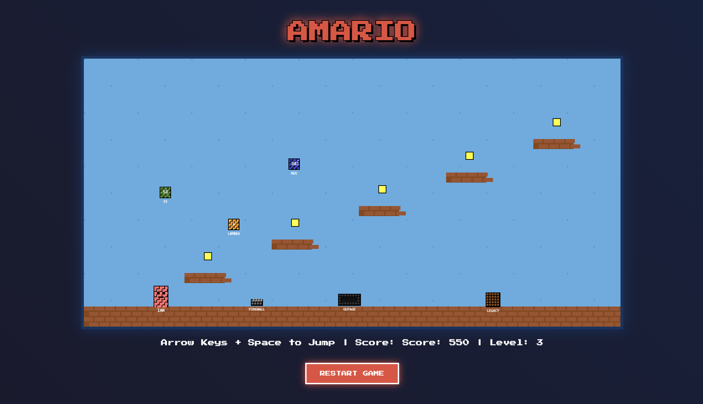
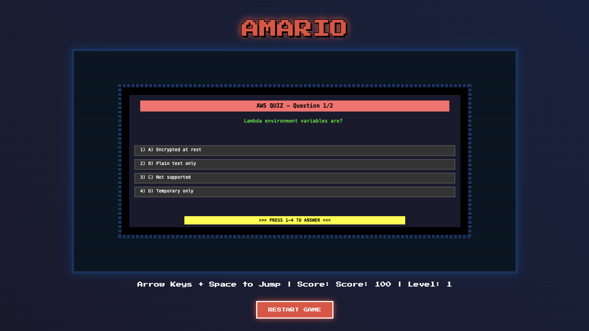

# AMARIO - A Retro-Style AWS Learning Platform Game

AMARIO is an interactive educational game that teaches AWS cloud services through a classic platformer experience. Players navigate through challenging levels while learning about AWS services like EC2, Lambda, S3, and RDS through engaging gameplay mechanics and an integrated quiz system.

The game combines retro-style platforming with modern cloud computing education, featuring dynamic obstacles, collectible coins, and service-themed enemies. Each level presents increasingly complex challenges while reinforcing AWS concepts through interactive gameplay and quiz questions that use relatable analogies to explain cloud services.

## Screenshots




## Repository Structure
```
.
├── index.html              # Main entry point and game canvas setup
├── js/                     # Core game logic and components
│   ├── game.js            # Main game loop and state management
│   ├── player.js          # Player character controls and rendering
│   ├── enemy.js           # Enemy behavior and AWS service theming
│   ├── quiz.js            # AWS educational quiz system
│   ├── collision.js       # Collision detection between game elements
│   ├── camera.js          # Viewport management and scrolling
│   ├── level.js           # Level loading and management
│   ├── coin.js            # Collectible item logic
│   └── obstacle.js        # Platform and hazard implementations
└── levels/                 # Level configuration files
    ├── level1.js          # Introductory level layout
    ├── level2.js          # Intermediate challenge layout
    ├── level3.js          # Advanced platform configuration
    ├── level4.js          # Expert level design
    └── level5.js          # Final challenge configuration
```

## Usage Instructions
### Prerequisites
- Modern web browser with HTML5 Canvas support
- JavaScript enabled
- Minimum screen resolution: 800x600

### Installation
1. Clone the repository:
```bash
git clone https://github.com/yourusername/amario.git
```

2. Navigate to the project directory:
```bash
cd amario
```

3. Open index.html in a web browser:
- **MacOS/Linux**:
```bash
open index.html    # MacOS
xdg-open index.html # Linux
```
- **Windows**:
```bash
start index.html
```

### Quick Start
1. Open the game in your web browser
2. Use arrow keys to move:
   - Left/Right: Move horizontally
   - Up/Space: Jump
3. Collect coins and avoid obstacles
4. Answer AWS-related quiz questions when prompted
5. Reach the exit to complete each level

### More Detailed Examples
1. **Basic Movement**
```javascript
// Use keyboard controls
Left Arrow  -> Move left
Right Arrow -> Move right
Up Arrow    -> Jump
Space       -> Alternative jump
```

2. **Interacting with AWS Service Enemies**
- Jump on enemies to defeat them
- Each enemy represents an AWS service:
  - EC2: Standard movement pattern
  - Lambda: Fast movement
  - S3: Bouncing movement
  - RDS: Slow but steady movement

### Troubleshooting
1. **Game Not Loading**
- Clear browser cache
- Ensure JavaScript is enabled
- Check browser console for errors
- Verify all game files are present

2. **Controls Not Responding**
- Ensure no other application is capturing keyboard input
- Check if keyboard focus is on the game window
- Try refreshing the page

3. **Performance Issues**
- Close other browser tabs
- Disable browser extensions
- Reduce browser zoom to 100%
- Check system resources usage

## Data Flow
The game operates on a frame-by-frame update cycle, processing player input, updating game state, and rendering the scene.

```ascii
[Player Input] -> [Game State] -> [Physics/Collision] -> [Quiz System] -> [Render]
      ↑              |                    |                   |             |
      |              v                    v                   v             v
[Keyboard/Touch] [Entity Updates] [Collision Detection] [Question Logic] [Canvas]
```

Key component interactions:
1. Game loop manages frame updates and state transitions
2. Player input triggers movement and actions
3. Collision system checks for interactions between entities
4. Quiz system integrates with gameplay events
5. Camera follows player movement
6. Level manager loads and maintains level configuration
7. Enemy AI processes service-specific behaviors
8. Rendering system draws all game elements to canvas